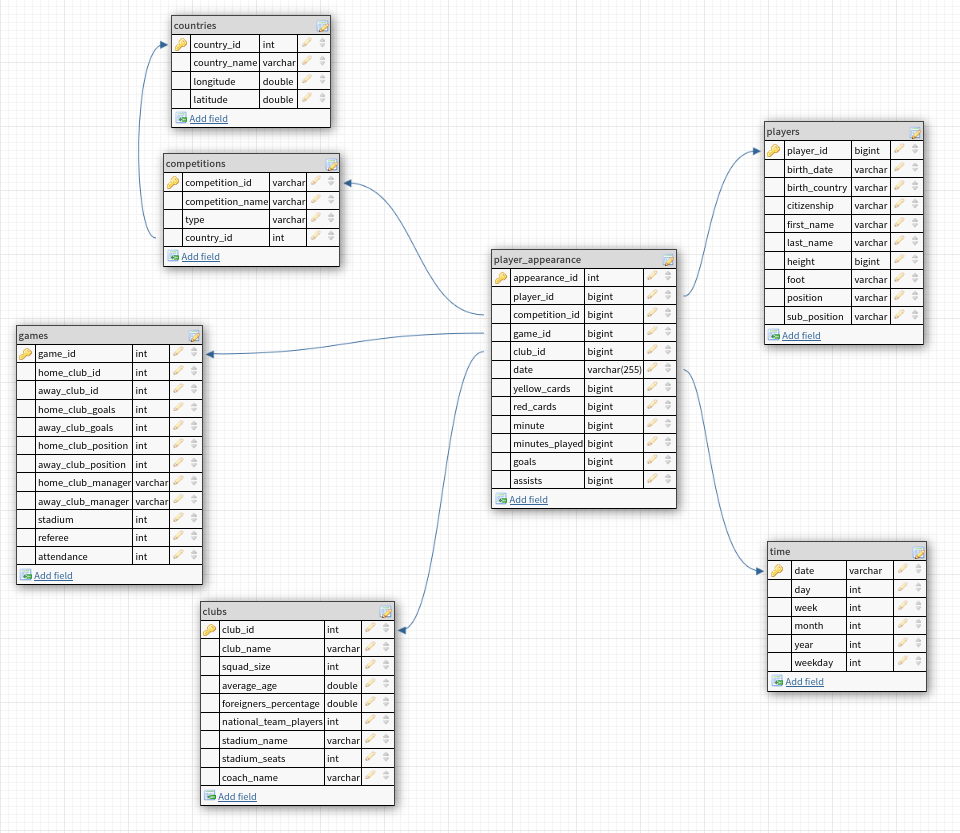

# Football player appearance data analysis
### Data Engineering Capstone Project

#### Project Summary
Create a data warehouse analyzing football player appearances based on multiple source from `football_data_transfer_market` for European competitions. Either raw CSV datasets or a normalized JSON dataset.
    - Player appearance analysis: By analyzing various player stats such as goals, assists, yellow_cards, red_cards. One can evaluate the performance of individual players and identify areas where they need to improve.

# Datasets used

`Football Data from Transfermarkt`: https://www.kaggle.com/datasets/davidcariboo/player-scores
    - Football (Soccer) data scraped from Transfermarkt website
    The dataset is composed of multiple CSV files with information on competitions, games, clubs, players and appearances that is automatically updated once a week. Each file contains the attributes of the entity and the IDs that can be used to join them together.
`player_appearance`: JSON made data source from Football Data from Transfermarkt by combining two datasources together using `prepare_raw_data.ipynb`

The project follows the follow steps:
* Step 1: Scope the Project and Gather Data
* Step 2: Explore and Assess the Data
* Step 3: Define the Data Model
* Step 4: Run ETL to Model the Data
* Step 5: Complete Project Write Up

# Step 1: Scope the Project and Gather Data

#### Scope

Create analytics database for football player appearances in European competitions:

- Use spark to load the raw datasets.
- Explore the datasets for `player_appearances` and perform data cleaning.
- Read and create dimension tables from `games`, `clubs`, `competitions`, `player_appearances` datasets.
- Write fact and dimension tables to parquet files.
- Apply data quality checks on all table and raise error if a check failed.

### Step 2: Explore and Assess the Data
#### Explore the Data 
Identify data quality issues, like missing values, duplicate data, etc.

### Step 3: Define the Data Model
#### 3.1 Conceptual Data Model
Map out the conceptual data model and explain why you chose that model

The fact table is made up from the JSON raw dataset `players_appearances`. This fact table consists of the appearance attributes for players in every minute of the game.

The needed dimensions for this model are:
- players: for details related to the player origin, position, and age.
- games: for details related to the place of the game, managers, clubs, and goals.
- competitions: to track the main competition for every game a table with the competitions details is needed.
- countries: This table has only the countries with competitions included in our data model.
- time: for a more detailed time attributes, this table splits the appearance dates into more dimensions of interest.

All the dimensions tables are collected from CSV datasets from football_data_transfer_market original data. Except for players and time tables, which are similar to player_appearance table are collected from the JSON raw data files.

All dimension table link to the fact `player_appearance` table through the date and different primary IDs in every dimension.

#### 3.2 Mapping Out Data Pipelines
List the steps necessary to pipeline the data into the chosen data model

- Load the raw datasets.
- Investigate the players_appearances raw dataset.
- Applying some cleaning for the players_appearances raw dataset.
- Create dimensions tables: [players, games, clubs, competitions, countries, time]
- Create fact table: player_appearance.
- Apply data quality checks over dimension and fact table.

### Step 4: Run Pipelines to Model the Data 
#### 4.1 Create the data model
- Build the data pipelines to create the data model.

#### 4.2 Data Quality Checks
 
Run Quality Checks:
1- Data availability by checking that all data frames exists.
2- Table data completeness and no missing rows for any table. 