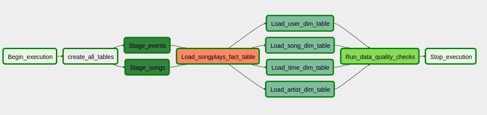

# Data Pipelines with Airflow

A music streaming company, Sparkify, has decided that it is time to introduce more automation and monitoring to their data warehouse ETL pipelines and come to the conclusion that the best tool to achieve this is Apache Airflow.

The purpose of this project is to improve on last projects and create dynamic data pipeline with reusable tasks that can be monitored, and allow easy backfills.

The source data resides in S3 and needs to be processed in Sparkify's data warehouse in Amazon Redshift. The source datasets consist of JSON logs that tell about user activity in the application and JSON metadata about the songs the users listen to.

## Dag operation
Below are two screenshots of the same Sparkify dag. The first is without using sub-dags and the second is after collecting all `loadDimension` tasks in a sub-dag `load_dimensions_subdag`.

*Sparkify initial dag*

*Sparkify dag after using a sub-dag for loading all dimensions*

The dag is expected to retry tasks after failure for 5 trials, with a 2 minutes delay between every failure.

## Instructions

### Datasets
There are two datasets:
- Log data: s3://udacity-dend/log_data
- Song data: s3://udacity-dend/song_data

### Data schema

Fact Table

    songplays - records in event data associated with song plays i.e. records with page NextSong
        songplay_id, start_time, user_id, level, song_id, artist_id, session_id, location, user_agent

Dimension Tables

    users - users in the app
        user_id, first_name, last_name, gender, level
    songs - songs in music database
        song_id, title, artist_id, year, duration
    artists - artists in music database
        artist_id, name, location, lattitude, longitude
    time - timestamps of records in songplays broken down into specific units
        start_time, hour, day, week, month, year, weekday

## Project Contents

The project consist of two main directories. `dags` and `plugins`.

- `dags` - consists of the all sparkify dags and SQL file
  - `sparkify_dag` - main sparkify dag.
  - `load_dimensions_subdag` - sub-dag for loading all dimension tables.
  - `create_tables.sql` - SQL queries for creating the fact and dimensional tables.
- `plugins` - consists of helpers and operators directories.
  - `helpers` - consists of `sql_queries` for selecting data for dimension and fact tables, and the reusable operators.
  - `operators` - consists of different customizable operators that perform the dag's tasks.

## Operators

- Stage operator: 
  It is expected to load any JSON formatted file from S3 to Amazon Redshift. The operator creates and runs SQL COPY statement based on the parameters provided. The operator's parameters should specify where in S3 the file is loaded and what is the target table.
  A parameter is used to distinguish between JSON files.

- Fact operator:
  It is used to insert data into our songplay fact table. SQL statement is given as input for the operator as well as the target database table.

- Dimension Operators:
  It is used to insert data into our 4 dimensional tables. SQL statement is given as input for the operator as well as the target database table.
  A truncate parameter can be used to allow switch between append and insert-delete functionality.

- Data Quality Operator:
  This is used for data quality validation. At the last step a check runs on the data itself. The operator receives a list of dictionaries with two keys, SQL test cases along with the expected results. For each dictionary, a check is done, and a match between the given SQL query results and the given expected result is required. Otherwise, a `ValueError` is raised.
